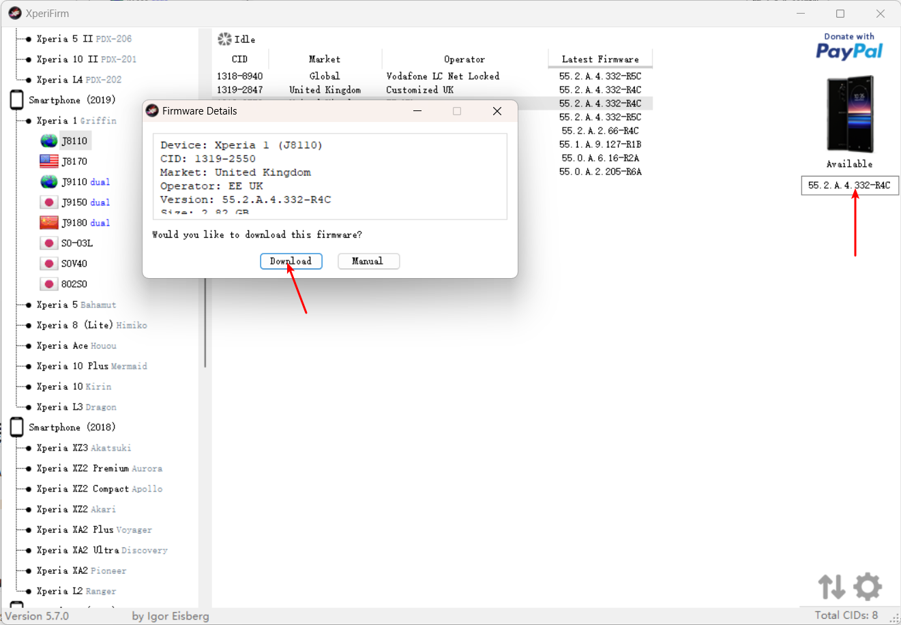
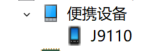
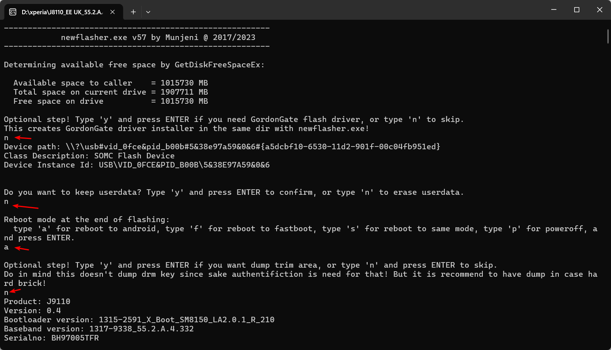
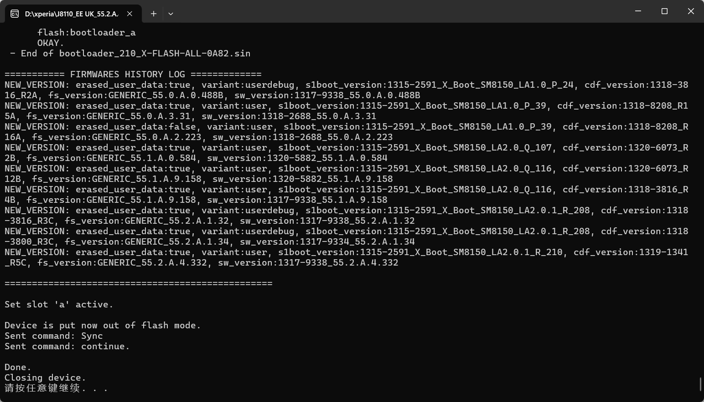

## 准备

- [XperiaFirm](https://xdaforums.com/t/tool-xperifirm-xperia-firmware-downloader-v5-7-0.2834142/)

  第三方工具，用来下载官方固件，支持全球地区固件下载。

- [newFlasher](https://xdaforums.com/t/tool-newflasher-xperia-command-line-flasher.3619426/)

  刷机工具，内置驱动安装包。

## 下载固件

打开XperiaFirm64.exe， 选择自己的型号。

1. 选择好版本点击这里进行下载

   

2. 等待下载完成，如果网速慢，请使用科学上网。

## 安装驱动

打开newFlasher，第一次输入y，即可在当前目录下看到驱动安装包，安装即可。

然后USB连接手机，若设备管理器看到正确显示你的手机，即安装成功。

## 刷机

1. 检查固件目录有`simlock.ta`文件，如有，请删除。不然可能会没信号。

2. 复制`newflasher.exe`到固件目录内，

3. 手机关机，按住音量下按键，同时连上USB数据线，此时，手机LED显示为**绿灯**时松开按键；连接成功。

4. 双击打开`newflasher.exe`即可开始刷机。

   分别输入**n, n, a, n**来完成指令选择。

   此模式会完全格式化手机，不保留任何用户数据。

5. 耐心等待刷机完成，手机会自动重启开机。

刷机完成：

## Tips

请**优先使用HK地区的固件**，这样内置了Google服务，同时插卡可以正常使用。实测TW和UK等地区的固件，使用电信运营商会**没有信号**。
