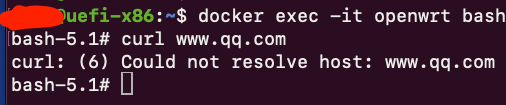
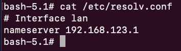
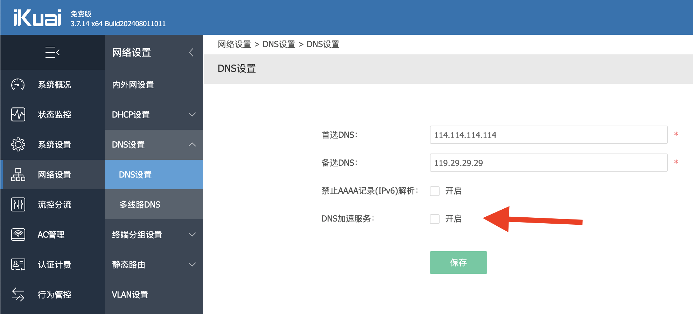
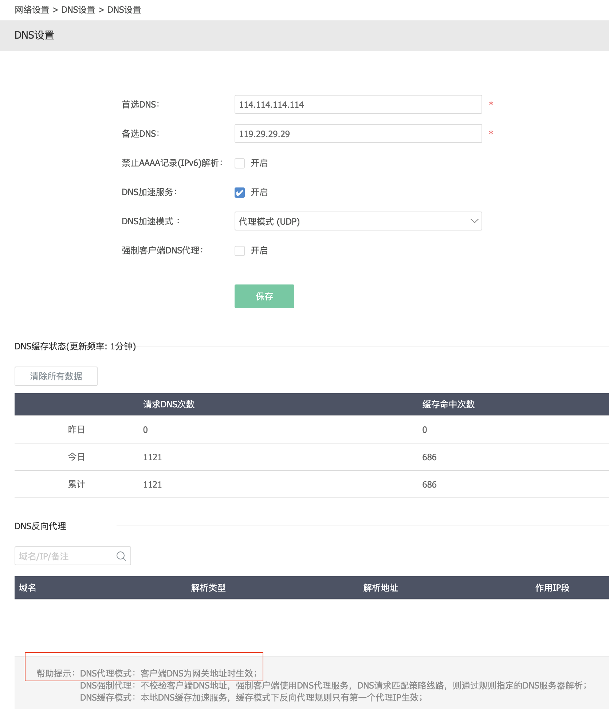
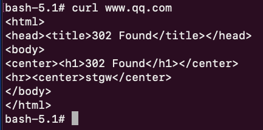

## 背景

最近一直在折腾，在`docker`中安装`openwrt`。

容器创建成功了，但是我发现容器内总是无法访问外部网络。

具体 现象为执行curl命令的时候一直返回，无法解析域名，如下

## 排查过程

我查询了一下 本机的DNS配置，其正确的指向了 路由器的IP地址 

那向上排查有可能是路由器的原因，并且考虑到最近家里的网络环境有变化， **主路由器**被替换成安装**爱快**系统的软路由。

于是检查了爱快的DNS配置， 发现有个选项默认并没有打开

我稍作搜索后发现这里的**DNS加速服务**就是指的路由器的本机DNS解析功能。开启这个功能后，可以看到二级菜单

DNS加速模式默认为**代理模式**，也就是路由器帮你**发送DNS解析请求到上面配置的DNS服务器**。

图中的帮助提示，也表明内网设备中只有DNS配置指向路由器的IP地址（网关地址）时，这个功能才生效。

事实上，这个功能大部分消费级路由器都是**默认提供**的（起码有解析功能），不知道为啥爱快默认是关闭的。

保存配置后，测试

curl成功返回`302`，问题解决。
