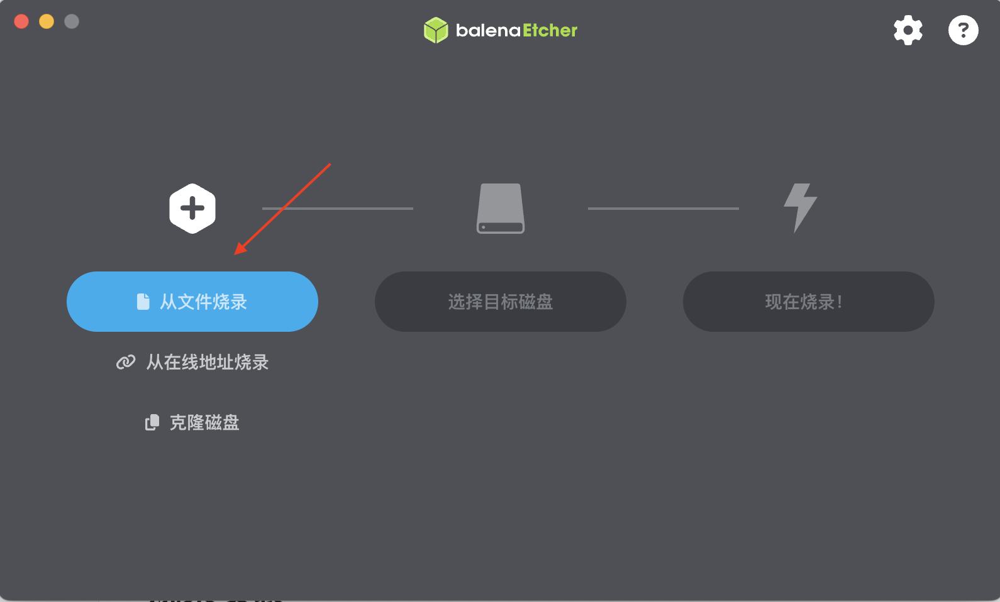
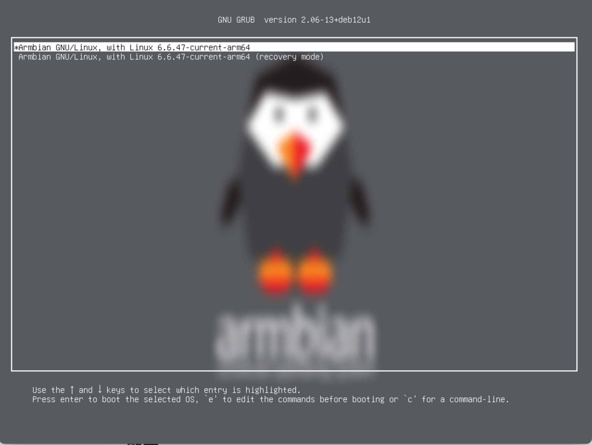
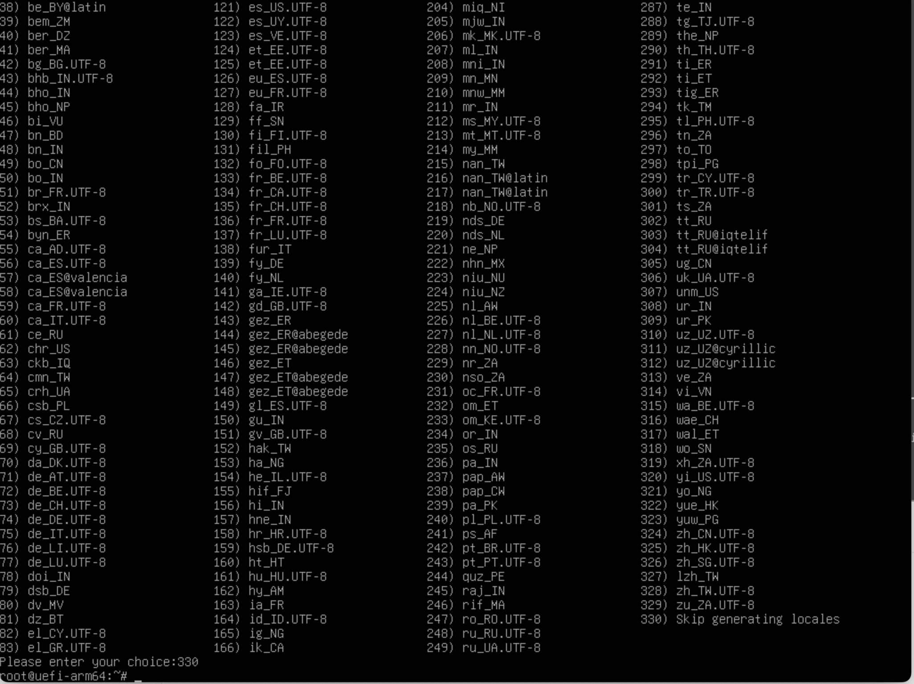
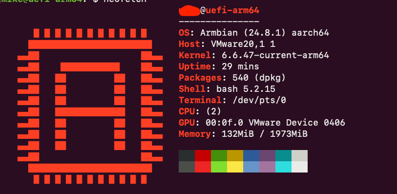

## 背景

之前安装`Linux Server`版的系统，一直都是通过`ISO`光盘镜像的方式，但ISO`内`置的**Installation Wizard**很麻烦，要选择和配置一堆东西。而且还要连接显示器（最大痛点），

另外，`Ubuntu`和`Debian`官方都只提供`ISO`的方式，无法跳过**Installation Wizard**。

最近发现了一个`debian`的衍生系统：`armbian`，其无论是`amd64`还是`arm64`都提供了`img`硬盘镜像，安装的时候，只要你通过USB读取你的硬盘（USB硬盘盒），就可以直接烧录img进硬盘，系统就可以启动，非常方便，这里记录分享一下。

## 准备工作

1. `USB`硬盘盒

   看你的硬盘类型，可以是

   `SATA`转`USB`或M2（NVME）转`USB`

2. 下载img标准硬盘镜像（debian）：

	[Arm64](https://dl.armbian.com/uefi-arm64/Bookworm_current_server)

 	[Amd64](https://dl.armbian.com/uefi-x86/Bookworm_current_server)
 	
 	其他版本可以去armbian的[官网网站](https://www.armbian.com/download/?device_support=Standard%20support)下载。

3. 安装烧录软件balenaEtcher

	windows 用户去[官网](https://etcher.balena.io/)下载，macos直接使用homebrew安装

```shell
brew install --cask balenaetcher
```

## 烧录安装

1. 拆下你的空硬盘，装进USB硬盘盒，并连接上另一台PC（Windows或Macos皆可）

2. 解压缩下载的`img.xz` 文件

3. 选择得到的img文件

   

4. 选择你的USB外置硬盘，注意查看硬盘大小，别选错了

5. 点击烧录

6. 烧录完成后，把硬盘安装回你的PC，启动

7. 看到这界面就表示系统安装成功了

   

## 配置

1. 启动后，会提示你设置`root`密码，还有创建用户

2. `locale`选择的时候，可以输入330来暂时跳过

   

   ### 更换国内源

   更换apt的源为国内USTC

   ```shell
   sudo sed -i 's/deb.debian.org/mirrors.ustc.edu.cn/g' /etc/apt/sources.list
   ```

   同时更换Debian Security

   ```shell
   sudo sed -i -e 's|security.debian.org/\? |security.debian.org/debian-security |g' \
               -e 's|security.debian.org|mirrors.ustc.edu.cn|g' \
               -e 's|deb.debian.org/debian-security|mirrors.ustc.edu.cn/debian-security|g' \
               /etc/apt/sources.list
   ```

   ### 手动设置时区和locale

   设置时区

   ```shell
   sudo timedatectl set-timezone Asia/Shanghai
   ```

   设置`locale`，以24小时方式显示时间

   用vi编辑`/etc/default/locale`，

   最后两行修改成

   ```shell
   LANG=en_GB.UTF-8
   LC_TIME=en_GB.UTF-8
   ```

   然后重启生效。最后放一张截图

   
