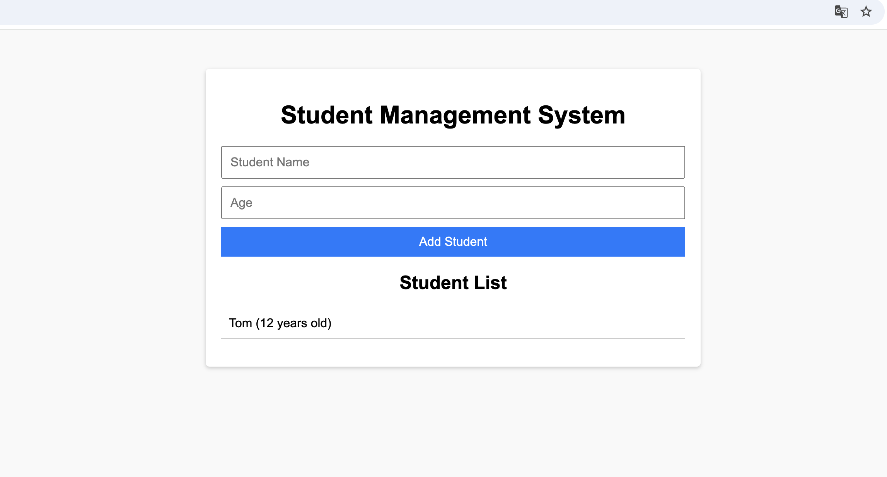

## 背景

最近在学习`Golang`，感受到`Google`的技术异常强大的同时，又听说同是`Google`家出来的`K8S`非常强大，什么微服务自动伸缩，扩容，定时任务调度啥的，无所不能，而且能非常方便的管理多台物理服务器，甚至是混合服务器（云+本地）。最近就开始简单学习试用了一下K8S，本文简单记录下心得。

## 准备工具

### 本地工具

为了在本地使用`K8S`，需要一些额外工具，因为`K8S`似乎不支持单机部署。

主流工具两种：[Kind](https://kind.sigs.k8s.io/)和[Minikube](https://kubernetes.io/zh-cn/docs/tutorials/hello-minikube/)

来自ChatGPT的对比

> 以下是 **Kind** 和 **Minikube** 两者的对比，帮助您选择适合学习 Kubernetes 的工具：
>
> | **比较维度**     | **Kind**                                                     | **Minikube**                                 |
> | ---------------- | ------------------------------------------------------------ | -------------------------------------------- |
> | **设计目的**     | 用于模拟 Kubernetes 集群，特别是测试 Kubernetes API 和开发目的 | 单机 Kubernetes 集群，适合入门和学习         |
> | **安装和设置**   | 简单，基于 Docker 容器，无需 VM                              | 略复杂，需要配置虚拟机或容器化运行环境       |
> | **资源消耗**     | 较低，只需 Docker                                            | 较高，需要配置 VM 或其他驱动程序             |
> | **支持的环境**   | Docker (无需其他依赖环境)                                    | 支持多种驱动：VM、Docker、Podman、Bare Metal |
> | **启动时间**     | 启动速度快，适合快速创建集群                                 | 启动速度稍慢，受 VM 驱动影响                 |
> | **学习难度**     | 偏向高级用户，适合有 Kubernetes 基础的人                     | 适合初学者，界面和命令更简单直观             |
> | **可扩展性**     | 可模拟多节点集群，但配置稍复杂                               | 单节点集群更简单，也可配置多节点             |
> | **网络功能**     | 集成 Docker 网络，网络配置需要手动调整                       | 提供内置的网络插件，更适合入门者使用         |
> | **适用场景**     | 测试 Kubernetes 控制平面、开发环境                           | Kubernetes 基础学习、应用开发与测试          |
> | **社区支持**     | Kubernetes 官方支持，活跃社区                                | 拥有丰富文档和插件支持                       |
> | **容器运行时**   | 仅支持 Docker 容器运行时                                     | 支持 Docker、Containerd、CRI-O 等            |
> | **复杂性**       | 偏复杂，适合深入理解 Kubernetes 集群结构                     | 更简单，入门友好                             |
> | **操作系统支持** | 跨平台（需 Docker 支持）                                     | 跨平台，支持更多环境                         |
>
> ### **总结建议**：
>
> - **Kind**：适合已经有一些 Kubernetes 基础的用户，用来模拟复杂场景或学习 Kubernetes API 的运行细节。对资源需求较低，运行更轻量。
> - **Minikube**：更适合初学者学习 Kubernetes，安装和使用更直观，提供了更多学习工具和内置插件。

虽然GPT推荐Minikube，但是我看中并选择使用Kind，其比较轻量级，简单粗暴就是最好的。

macos使用kind直接安装:

```bash
brew install kind
```

### 练习应用程序

这里使用学生管理系统（完全由`ChatGPT`生成）来做演示练习，将其用K8S来部署。

架构:

* 前端：`html`,`css`,`js`文件各一个
* 后端 ：`golang`
* 数据库： `mongodb`

代码部分这里就不贴，源码请查看[github](https://github.com/sudowanderer/k8s-kind-student-app)

## Kind配置

首先，我们要明白`Kind`的工具的设计理念。

`Kind`的职责是帮你用`yaml`配置文件（`kind`来定义）和定制的`docker`镜像（`kind`提供）来启动一个`K8S`兼容的`Cluster`，这样你可以直接用`kubectl` cli工具来直接访问本地的集群（模拟出来的）。

### yaml配置

为了创建一个本地`k8s` `cluster`， 需要编写`yaml`配置kind-cluster-config.yaml：

```yaml
kind: Cluster
apiVersion: kind.x-k8s.io/v1alpha4
nodes:
  - role: control-plane
    extraMounts:
      - hostPath: ./frontend  # 宿主机的静态文件路径
        containerPath: /mnt/frontend            # Kind 容器中的挂载路径
    extraPortMappings:
      - containerPort: 80   # 前端服务的端口
        hostPort: 80
        protocol: TCP
```

注意，这里需要暴露80端口，这样咱们才能通过浏览器访问页面；然后要把前端文件的目录挂载到容器中，以让`ingress-nginx`来托管我们的文件。

### 创建cluster

下面开始创建`cluster`:

```bash
kind create cluster --config kind-cluster-config.yaml -n student-cluster
```

你可以看到输出：

```bash
student-management-system > kind create cluster --config kind-cluster-config.yaml -n student-cluster
Creating cluster "student-cluster" ...
 ✓ Ensuring node image (kindest/node:v1.31.2) 🖼
 ✓ Preparing nodes 📦  
 ✓ Writing configuration 📜 
 ✓ Starting control-plane 🕹️ 
 ✓ Installing CNI 🔌 
 ✓ Installing StorageClass 💾 
Set kubectl context to "kind-student-cluster"
You can now use your cluster with:

kubectl cluster-info --context kind-student-cluster

Not sure what to do next? 😅  Check out https://kind.sigs.k8s.io/docs/user/quick-start/
```

到这里`cluster`就创建成功了，你可以使用

```bash
kubectl get nodes
```

来查看`nodes`，输出如下

```bash
student-management-system > kubectl get nodes  
NAME                            STATUS   ROLES           AGE   VERSION
student-cluster-control-plane   Ready    control-plane   17m   v1.31.2
```

`kind`的默认行为是使用一个`docker`容器来创建`cluster`，也就是集群中的所有组件，都在这一个容器中运行，身兼多职。这也是为了节省资源。当你使用`docker ps`的时候，会发现只有一个student-cluster-control-plane容器在运行：

```bash
student-management-system > docker ps
CONTAINER ID   IMAGE                  COMMAND                   CREATED          STATUS          PORTS                                           NAMES
f5d7e0656420   kindest/node:v1.31.2   "/usr/local/bin/entr…"   21 minutes ago   Up 21 minutes   0.0.0.0:80->80/tcp, 127.0.0.1:59974->6443/tcp   student-cluster-control-plane
```

### 加载应用镜像到cluster

应用程序的后端，需要打包`docker`镜像。在真实的`k8s`环境中，一般都是到一个中央`docker`仓库中去拉取镜像（一般通过CI环境构建镜像并`push`镜像到docker`仓库`）。但是现在我们的`cluster`是一个`docker`容器，简单起见，我们直接在宿主机构建镜像然后加载到cluster容器中。

在工程的根目录运行：

```bash
docker build -t student-backend:latest .
```

然后加载镜像到cluster

```bash
kind load docker-image student-backend:latest  -n student-cluster
```

看到如下输出:

```bash
student-management-system > kind load docker-image student-backend:latest  -n student-cluster 
Image: "student-backend:latest" with ID "sha256:52061ec8b071f8552cc7f186b65a22280ee0aa20d139fc7f238429b569fd0f0d" not yet present on node "student-cluster-control-plane", loading...
```

## K8S配置

### 前端

#### 静态文件

前端的`pod`还是需要一个`nginx`来专门托管前端静态文件。

注意这里的挂载，目的就是把`cluster`的目录挂载到`pod`中，以让`nignx`使用。

k8s/frontend.yaml

```yaml
apiVersion: apps/v1
kind: Deployment
metadata:
  name: frontend
spec:
  replicas: 1
  selector:
    matchLabels:
      app: frontend
  template:
    metadata:
      labels:
        app: frontend
    spec:
      containers:
        - name: frontend
          image: nginx:latest
          ports:
            - containerPort: 80
          volumeMounts:
            - name: frontend-html
              mountPath: /usr/share/nginx/html
      volumes:
        - name: frontend-html
          hostPath:
            path: /mnt/frontend  # Kind 控制平面容器内的路径
            type: Directory

---
apiVersion: v1
kind: Service
metadata:
  name: frontend
spec:
  ports:
    - port: 80         # 服务端口
      targetPort: 80   # Pod 中的容器端口
  selector:
    app: frontend
  type: ClusterIP      # 仅暴露在集群内
```

#### 请求路由

`nginx`支持请求路由，一般在`docker-compose`中，我们会使用nginx来做请求路由。

但是k8s是支持请求路由的，目前主要有两个工具:

* Ingress
* Gateway API

来自`ChatGPT`的对比

> ### **Gateway API 与 Ingress 的核心区别**
>
> | 特性         | **Ingress**                           | **Gateway API**                         |
> | ------------ | ------------------------------------- | --------------------------------------- |
> | **成熟度**   | 已成熟，广泛使用，Kubernetes 核心功能 | 相对较新，仍在发展                      |
> | **功能范围** | 专注于 HTTP/HTTPS 路由管理            | 更通用，支持 TCP、UDP、HTTP(S) 等多协议 |
> | **灵活性**   | 灵活性有限，功能主要取决于实现方式    | 提供更多抽象，支持多租户和高级功能      |
> | **实现方式** | 基于控制器（如 NGINX、Traefik）       | 基于 CRD（自定义资源定义）              |
> | **适用场景** | 简单到中等复杂的 HTTP 路由场景        | 更复杂的网络场景，多协议/多租户需求     |
> | **社区支持** | 社区成熟，文档和工具丰富              | 社区支持逐步增强                        |

> ### **适用场景对比**
>
> #### **Ingress 的适用场景**
>
> - 项目需要简单的 HTTP 路由管理。
> - 项目已经使用了成熟的 Ingress 实现（如 NGINX、Traefik）。
> - 部署在托管 Kubernetes 服务上（如 GKE、EKS），这些服务往往原生支持 Ingress。
>
> #### **Gateway API 的适用场景**
>
> - 项目有更复杂的路由需求，例如多协议（TCP、UDP）。
> - 多租户环境，需要严格的路由隔离。
> - 想尝试新的 Kubernetes 网络栈功能，或未来计划扩展到高级场景。
> - 有 DevOps 团队可以管理 Gateway API 的复杂性。

为了少踩坑，我们优先使用成熟的`Ingress`工具。

这里，因为我们本地的`cluster`是使用`kind`模拟创建的，所以`ingress`我们需要安装`kind`官方提供的`ingress-nginx`

命令:

```bash
kubectl apply -f https://kind.sigs.k8s.io/examples/ingress/deploy-ingress-nginx.yaml
```

输出：

```bash
student-management-system >  kubectl apply -f https://kind.sigs.k8s.io/examples/ingress/deploy-ingress-nginx.yaml
namespace/ingress-nginx created
serviceaccount/ingress-nginx created
serviceaccount/ingress-nginx-admission created
role.rbac.authorization.k8s.io/ingress-nginx created
role.rbac.authorization.k8s.io/ingress-nginx-admission created
clusterrole.rbac.authorization.k8s.io/ingress-nginx created
clusterrole.rbac.authorization.k8s.io/ingress-nginx-admission created
rolebinding.rbac.authorization.k8s.io/ingress-nginx created
rolebinding.rbac.authorization.k8s.io/ingress-nginx-admission created
clusterrolebinding.rbac.authorization.k8s.io/ingress-nginx created
clusterrolebinding.rbac.authorization.k8s.io/ingress-nginx-admission created
configmap/ingress-nginx-controller created
service/ingress-nginx-controller created
service/ingress-nginx-controller-admission created
deployment.apps/ingress-nginx-controller created
job.batch/ingress-nginx-admission-create created
job.batch/ingress-nginx-admission-patch created
ingressclass.networking.k8s.io/nginx created
validatingwebhookconfiguration.admissionregistration.k8s.io/ingress-nginx-admission created
```

### 后端

k8s/backend.yaml

```yaml
apiVersion: apps/v1
kind: Deployment
metadata:
  name: backend
spec:
  replicas: 1
  selector:
    matchLabels:
      app: backend
  template:
    metadata:
      labels:
        app: backend
    spec:
      containers:
        - name: backend
          image: student-backend:latest
          imagePullPolicy: IfNotPresent # 优先拉取本地镜像！非常重要的配置
          env:
            - name: MONGO_URI
              value: mongodb://mongodb:27017
          ports:
            - containerPort: 8080

---
apiVersion: v1
kind: Service
metadata:
  name: backend
spec:
  ports:
    - port: 8080       # 服务端口
      targetPort: 8080 # Pod 中的容器端口
  selector:
    app: backend
  type: ClusterIP
```

### 数据库

这里需要先创建一个持久卷`PersistentVolumeClaim`，以存储我们的应用数据。

k8s/mongodb.yaml

```yaml
apiVersion: v1
kind: PersistentVolumeClaim
metadata:
  name: mongodb-pvc
spec:
  accessModes:
    - ReadWriteOnce
  resources:
    requests:
      storage: 1Gi
---
apiVersion: apps/v1
kind: Deployment
metadata:
  name: mongodb
spec:
  replicas: 1
  selector:
    matchLabels:
      app: mongodb
  template:
    metadata:
      labels:
        app: mongodb
    spec:
      containers:
        - name: mongodb
          image: mongo:latest
          ports:
            - containerPort: 27017
          volumeMounts:
            - name: mongodb-data
              mountPath: /data/db
      volumes:
        - name: mongodb-data
          persistentVolumeClaim:
            claimName: mongodb-pvc
---
apiVersion: v1
kind: Service
metadata:
  name: mongodb
spec:
  ports:
    - port: 27017
      targetPort: 27017
  selector:
    app: mongodb
  type: ClusterIP # 默认类型，分配一个集群内部的IP，只能在集群内部访问。
```

## 应用配置文件

准备好4个k8s yaml配置文件后，应用到k8s环境中

```bash
kubectl apply -f k8s
```

稍等片刻，所有pod都应启动并运行：

```bash
student-management-system > kubectl get pods
NAME                        READY   STATUS    RESTARTS   AGE
backend-b959558cf-gkhg5     1/1     Running   0          102m
frontend-55f598bfb9-nhk2r   1/1     Running   0          102m
mongodb-597ddbbb95-kw7df    1/1     Running   0          102m
```

打开浏览器，访问`localhost`

即可访问应用程序



## 总结与延伸

虽然通过`kind`工具，我们可以在本地方便的模拟`k8s`环境，但是可以看到，配置还是有点复杂的。

`k8s`的设计初衷就是为大型商业项目、用户量百万级别以上、微服务部署的项目提供一个标准化的部署工具。

所以，个人认为，对于小型项目，完全没必要用`k8s`部署。本地和生产环境，完全可以用`docker-compose`来部署，简单粗暴。

看看现在的很多小公司，为了使用最新的技术，亦或是卷IT从业者，强行把应用程序拆分用`k8s`部署，这本身就是本末倒置，舍近求远。